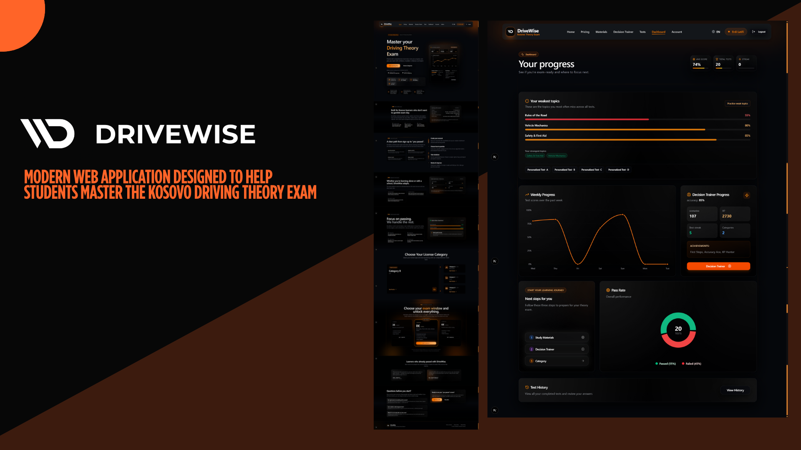

# DriveWise

**A complete driving-theory exam preparation platform — web app, mobile app, and admin backend, all in one repository.**



> **⚠️ Portfolio / demo project.** DriveWise is a demonstration product built to showcase full-stack engineering work — real-time analytics, gamified learning, a working payments integration, and a mobile companion app. It is **not** a commercially operated service. The checkout flow shows a clear "this is a demo" notice before any payment attempt, on purpose. See [Demo project & payments disclaimer](#-demo-project--payments-disclaimer) below.

---

## Table of contents

- [What DriveWise offers](#what-drivewise-offers)
- [Feature deep-dive](#feature-deep-dive)
  - [1. Intelligent testing system](#1-intelligent-testing-system)
  - [2. Analytics dashboard](#2-analytics-dashboard)
  - [3. Decision Trainer](#3-decision-trainer)
  - [4. Study materials & traffic signs](#4-study-materials--traffic-signs)
  - [5. Subscriptions & payments](#5-subscriptions--payments)
  - [6. Account, profile & trust features](#6-account-profile--trust-features)
  - [7. Admin panel](#7-admin-panel)
  - [8. Mobile app](#8-mobile-app)
- [Product tour / user journey](#product-tour--user-journey)
- [Tech stack](#tech-stack)
- [Repository layout](#repository-layout)
- [Database architecture](#database-architecture)
- [Security](#security)
- [Getting started](#getting-started)
- [Environment variables](#environment-variables)
- [Deploying the web app to Vercel](#deploying-the-web-app-to-vercel)
- [Scripts reference](#scripts-reference)
- [Demo project & payments disclaimer](#-demo-project--payments-disclaimer)
- [License](#license)

---

## What DriveWise offers

DriveWise helps learner drivers in Kosovo prepare for the official driving theory exam, across four license categories (**A** motorcycle, **B** car, **C** truck, **D** bus). If you were evaluating this as a real product, here's the pitch:

- **Practice like the real exam.** Full mock tests built from the same question pool style as the official exam, with instant scoring and a pass/fail threshold.
- **Know exactly what to study next.** Every test attempt is analyzed to surface *weak topics*, which link straight to the relevant study chapter — no guessing what to review.
- **Train judgment, not memorization.** A separate "Decision Trainer" mode drills hazard-perception and real-world decision scenarios, not just multiple-choice recall.
- **See your progress, not just a score.** A full analytics dashboard (average score, weekly trend, streaks, topic mastery) turns raw attempts into a study plan.
- **One codebase, two apps.** The same account, the same progress, and the same content works on the web app and the native mobile app (iOS/Android via Expo).
- **Pay once per category, no subscriptions.** Each paid plan unlocks one license category for a fixed period — no recurring billing, no dark patterns.
- **Admin-run content, not hardcoded.** Every question, study chapter, and traffic sign is managed through an in-app admin panel backed by Postgres — non-technical staff could maintain content without touching code.

---

## Feature deep-dive

### 1. Intelligent testing system

- **Official-style mock tests** — ten predefined tests per category plus fully randomized "mixed" tests, mirroring the structure of the real exam.
- **Personalized tests** — once a learner has enough history, the system builds a test drawn specifically from the topics they get wrong most often.
- **Resilient progress** — an in-progress test survives a page refresh; learners never lose their place mid-test.
- **Result review** — every submitted test shows a full breakdown: score, pass/fail (80% threshold), and per-question review with the correct answer and explanation.
- **Weak-topic detection** — the platform tracks *which kind of question* a learner struggles with (not just which test), and links directly into the matching Study Material chapter.
- **First-test engagement** — after a learner's very first completed test, they're prompted to rate the app — a lightweight, well-timed feedback loop.

### 2. Analytics dashboard

- **Performance overview** — average score, total tests taken, best score, and tests completed this week, at a glance.
- **Weekly progress chart** — an interactive 7-day trend line so learners can see whether they're actually improving.
- **Deep-dive insights (unlocked after 20 tests)** — a "weak topics" breakdown with color-coded mastery bars (red = weak, orange = average, green = strong), plus a computed "dominant weak category" that tells the learner the single best place to focus next.
- **Streak tracking** — a single daily streak counter that combines both mock-test activity and Decision Trainer activity, encouraging daily practice.

### 3. Decision Trainer

- **Scenario-based training** — short, realistic traffic situations (not simple trivia) that test hazard perception and judgment, sometimes with more than one valid answer.
- **XP & levels** — correct decisions earn XP; XP accumulates into visible level progression.
- **Leaderboard** — a global leaderboard ranks top performers. It's backed by a Postgres **materialized view** rather than a live aggregate query, so it stays fast even as attempt history grows, refreshing on a trigger instead of on every page load.

### 4. Study materials & traffic signs

- **Chapter-based learning content** — thirteen structured chapters covering everything from basic traffic rules to breakdown procedures, each rendered from admin-authored structured JSON content (text + images).
- **Traffic sign library** — a searchable, categorized reference of official road signs (danger, prohibition, mandatory, informational), each with an image, code, and description.
- **Smart linking** — weak-topic results on the dashboard deep-link straight into the matching chapter, closing the loop between "what you got wrong" and "what to read."

### 5. Subscriptions & payments

- **Category-scoped plans** — a learner buys access to *one* license category at a time (1, 2, or 3-month windows), not an all-or-nothing subscription.
- **No recurring billing** — plans are one-time purchases with a fixed expiry; there's no auto-renewal to cancel.
- **Paddle Hosted Checkout** — the actual card entry happens entirely on Paddle's hosted, PCI-compliant page; DriveWise never touches raw card data.
- **Signature-verified provisioning** — a webhook (HMAC-SHA256 verified) listens for completed transactions and provisions the purchase into `orders`, `payment_transactions`, and `user_plans` — the plan activates automatically, with no manual admin step.
- **Subscription management** — learners can view their active plan and days remaining, and cancel auto-renewal (for recurring products) directly from their profile.
- **Demo disclaimer built into the flow** — because this is a portfolio project, the checkout button doesn't jump straight to Paddle. It first shows a clear "this is a demo, not a real product" modal that the user has to actively acknowledge. See [below](#-demo-project--payments-disclaimer).

### 6. Account, profile & trust features

- **Bug reporting** — a built-in modal lets any user report a problem (title, description, repro steps, location in the app, device/browser, optional contact email) straight to the admin team, with server-side validation on every field.
- **GDPR-style account deletion** — a "danger zone" flow that permanently deletes the account and asks for an optional reason first ("I passed the exam," "not satisfied," etc.), storing that feedback anonymously (decoupled from the deleted account) so the reason for churn isn't lost.
- **Editable profile** — display name and basic account info, validated and length-capped both client- and server-side.

### 7. Admin panel

- **Content management** — full CRUD for test questions, study material chapters, traffic signs, and Decision Trainer scenarios, each with its own validated create/edit form.
- **User management** — a searchable, filterable, **server-side paginated** user list (via a dedicated Postgres RPC function, so it stays fast at thousands of users), with actions to promote/demote admins, block users, or grant a plan manually.
- **Stats dashboard** — a real-time overview of total users, tests taken, and revenue-style metrics, computed via database RPC rather than pulled client-side.
- **Role-gated everywhere** — every admin route and mutation checks `user_profiles.is_admin` both in the UI and (for the parts that go through an API route) on the server.

### 8. Mobile app

The `mobile/` app is a full **Expo + React Native** application — not a stripped-down companion, but a near 1:1 feature port of the web app, sharing the same Supabase backend and account:

- Full auth flow (login / register / reset password) with the same zod-validated forms as web.
- Category selection, mock test taking (instructions → test runner → results), and personalized tests.
- Decision Trainer (scenario list → game → results) with the same XP/leaderboard system.
- Study materials and the traffic sign library, browsable offline-tolerant with network-status handling.
- Profile, subscription screen, bug reporting, and account deletion modals — mirroring the web equivalents.
- An admin dashboard screen for admins who are on mobile.
- A full light/dark theme system, error boundary, and skeleton loading states throughout.
- Built with **NativeWind** (Tailwind for React Native), **React Navigation** (stack + bottom tabs), and **TanStack Query** for data fetching — the same query/cache patterns used on web.

Web and mobile share business logic through an internal workspace package, `@drivewise/core` (see [Repository layout](#repository-layout)), rather than duplicating hooks and types across both apps.

---

## Product tour / user journey

1. **Sign up** → a Postgres trigger automatically creates the matching `user_profiles` row.
2. **First test** → the learner completes Test 1 → submits → the app prompts a quick app rating.
3. **Learning loop** → the learner fails a topic → clicks "Study this topic" → lands directly on the matching Study Material chapter.
4. **Mastery unlock** → after **20 completed tests**, the dashboard unlocks the "Weak Topics" deep-dive module, and the learner can generate a Personalized Test that targets exactly those weak spots.
5. **Decision Trainer** → in parallel, the learner works through hazard-perception scenarios, earning XP and climbing the leaderboard.
6. **Going premium** → the learner picks a category + plan on `/pricing`, sees the demo disclaimer, confirms, and is redirected to Paddle; the webhook activates their plan the moment payment completes.
7. **Completion** → once the learner passes their real exam, they can delete their account from their profile, optionally leaving a "Passed!" testimonial that's stored for product feedback even after the account is gone.

---

## Tech stack

### Web (`web/`)
| Layer | Choice |
|---|---|
| Framework | [Next.js 16](https://nextjs.org/) (App Router, Turbopack) |
| Language | TypeScript |
| Database / Auth / Storage | [Supabase](https://supabase.com/) (Postgres + Auth + Storage) |
| Data fetching / caching | TanStack Query (React Query) |
| Styling | Tailwind CSS v4 + shadcn/ui + Radix primitives |
| Animation | Framer Motion |
| Charts | Recharts |
| Validation | Zod |
| Payments | Paddle (Hosted Checkout + REST API + verified webhooks) |
| Icons | Lucide |

### Mobile (`mobile/`)
| Layer | Choice |
|---|---|
| Framework | Expo (React Native, `expo-dev-client`) |
| Navigation | React Navigation (native-stack + bottom-tabs) |
| Styling | NativeWind (Tailwind for React Native) |
| Data fetching | TanStack Query |
| Forms & validation | React Hook Form + Zod |
| Backend | Supabase (same project as web) |

### Shared (`packages/core/`)
An internal npm workspace package consumed by `mobile/` (and progressively adopted by `web/`) containing shared Supabase context, database types, and TanStack Query hooks (subscriptions, leaderboard, users, decision trainer, scenarios, test questions, materials, test attempts) — so business logic for things like "how do we compute a leaderboard" or "what counts as an active plan" is defined once.

---

## Repository layout

```text
./
├── web/                    # Next.js web app (the main product surface)
│   ├── app/                #   App Router pages, incl. app/api/** route handlers
│   ├── components/         #   Shared React components + ui/ primitives (shadcn)
│   ├── hooks/               #   TanStack Query hooks (mirrors packages/core, being consolidated)
│   ├── lib/                 #   Business logic: subscriptions, paddle-api, validations/*
│   ├── contexts/            #   Auth + language React contexts
│   ├── utils/supabase/      #   Client/server/admin/middleware Supabase clients
│   └── database/            #   Local SQL working copy (git-ignored, see below)
├── mobile/                 # Expo React Native app
│   └── src/
│       ├── screens/         #   auth/, main/, test/, literature/, subscription/, admin/
│       ├── navigation/      #   RootNavigator, AppNavigator, LiteratureNavigator
│       ├── components/      #   Modals, skeletons, error boundary, network status
│       └── contexts/        #   Auth + category selection contexts
├── packages/
│   └── core/                # @drivewise/core — shared types, contexts, and query hooks
├── database/                # SQL scripts to set up the Supabase project from scratch
│   ├── 01_schema.sql        #   Tables, enums, indexes, triggers, RPC functions, storage buckets
│   └── 02_rls.sql           #   Row Level Security policies for every table
├── LICENCE                  # Proprietary license — see below
└── package.json              # npm workspaces root ("workspaces": ["web", "mobile", "packages/*"])
```

> **Note:** the repo root also contains a legacy Expo entry point (`App.tsx`, `app.json`, `metro.config.js`, `babel.config.js`) left over from an earlier `react-native-web` experiment. The actively developed, feature-complete mobile app lives in `mobile/` — treat the root-level Expo files as historical scaffolding, not the real app.

---

## Database architecture

The schema lives in `database/01_schema.sql` and `database/02_rls.sql` and is applied directly in the Supabase SQL editor (there's no separate migration tool — see [Getting started](#getting-started)).

- **~16 tables** covering users/profiles, questions, test attempts, study materials, traffic signs, Decision Trainer scenarios, orders, payment transactions, user plans, bug reports, and user feedback.
- **Row Level Security everywhere.** Every table has explicit RLS policies — users can only read/write their own rows (test attempts, profile, orders); content tables are admin-write, public-read; feedback tables allow inserts but restrict reads to admins.
- **`SECURITY DEFINER` functions with a fixed `search_path`** for every RPC function, to avoid the classic Postgres privilege-escalation pitfall of unqualified function search paths.
- **RPC-driven aggregation** — expensive rollups (`get_dashboard_stats`, `get_weekly_progress`, `get_recent_tests`, `get_admin_dashboard_stats`, `get_users_with_stats`) run as database functions instead of client-side loops, so the client fetches a finished answer, not raw rows to crunch.
- **A materialized view** (`decision_trainer_leaderboard`) caches the leaderboard computation so it doesn't recompute on every page view.
- **Targeted indexes** — GIN indexes on JSONB columns (e.g. `selected_options`) and B-Tree indexes on the foreign keys/columns actually used in `WHERE`/`ORDER BY` clauses (`user_id`, `category`, `completed_at`).
- **Server-side pagination for admin lists** — the admin user list, for example, is backed by a single RPC call that returns paginated rows *with* attempt counts already joined, avoiding an N+1 query pattern in the browser.

---

## Security

This project has had a real hardening pass, not just RLS-and-hope:

- **Row Level Security on every table** is the baseline — even if application-level checks were bypassed, the database itself refuses cross-user access.
- **Server-side input validation with Zod** on every API route that accepts a body or route parameter (`/api/admin/plans/grant`, `/api/orders/[id]`, `/api/paddle/subscription/[id]`, `/api/account/delete`, `/api/reports/bug`) — not just truthiness checks, but type, format (UUID / Paddle-ID pattern / email), and length-bounded validation. See `web/lib/validations/`.
- **PostgREST filter-injection hardening** — every free-text search box that builds a `.or()` filter string (question search, user search, materials, traffic signs, Decision Trainer scenarios) sanitizes the search term first (`sanitizeSearchTerm` in `web/lib/validations/common.ts`) to strip characters that have special meaning in PostgREST's filter syntax (`, . ( ) %`).
- **Length-capped free-text fields** everywhere a user or admin can type — bug reports, account-deletion feedback, profile name, and every admin content form (questions, study materials, Decision Trainer scenarios, traffic signs) — enforced both with HTML `maxLength` and a matching server-side/schema check, so the two can't drift apart.
- **Webhook signature verification** — the Paddle webhook (`web/app/api/paddle/webhook/route.ts`) verifies an HMAC-SHA256 signature before processing anything, and now **rejects** transactions with a missing/invalid license category instead of silently writing an `'UNKNOWN'` row.
- **Defense-in-depth on external API calls** — subscription IDs are format-validated (`paddleIdSchema`) *and* `encodeURIComponent`-escaped before being interpolated into outbound Paddle API URLs.
- **Security headers** set globally in `web/next.config.ts`: `X-Frame-Options: DENY`, `X-Content-Type-Options: nosniff`, a locked-down `Permissions-Policy`, `Referrer-Policy`, and a 2-year `Strict-Transport-Security` with preload.
- **Admin gating** derived from `user_profiles.is_admin`, checked both in the UI and, for routes that use the service-role client (which bypasses RLS), explicitly re-checked on the server before any privileged write.
- **Blocked users** are handled via `user_profiles.is_blocked`.

**Known, honest limitation:** rate limiting today is client-side only (`web/hooks/use-rate-limit.ts`, applied to the auth forms) — it improves UX but is not a real server-side control, since it resets on page reload and doesn't apply to API routes or admin mutations. If this were a real production service, the next hardening step would be a server-side rate limiter (e.g. an edge middleware backed by a store like Upstash Redis) and a `Content-Security-Policy` header, which are not yet in place.

---

## Getting started

### Prerequisites

- Node.js (latest LTS recommended)
- npm (this repo uses **npm workspaces**, not pnpm/yarn workspaces)
- A [Supabase](https://supabase.com/) project (free tier is enough for development)
- A [Paddle](https://www.paddle.com/) account (Sandbox is fine) — only needed if you want to exercise the payments flow

### 1. Install dependencies

From the repo root (this installs `web`, `mobile`, and `packages/*` in one pass):

```bash
npm install
```

### 2. Set up the database

1. Create a new Supabase project.
2. Open the Supabase SQL editor and run, in order:
   - `database/01_schema.sql` — tables, enums, indexes, triggers, RPC functions, storage buckets.
   - `database/02_rls.sql` — Row Level Security policies for every table.
3. Confirm RLS is **enabled** on every table (the script does this, but double-check in the Supabase dashboard).

### 3. Configure environment variables

```bash
cp web/env.example web/.env.local
```

Fill in the values — see [Environment variables](#environment-variables) below for the full list and what each one does.

### 4. Run the web app

```bash
npm --workspace web run dev
# or, from inside web/:
npm run dev
```

The app runs at `http://localhost:3000`. Public (unauthenticated) routes include `/`, `/pricing`, and `/payment/success`; everything else is protected by Next.js middleware.

### 5. Run the mobile app

```bash
npm --workspace mobile run start
# or, from inside mobile/:
npm run start
```

If you're on a restricted network and devices can't reach your dev machine directly:

```bash
npx expo start --tunnel
```

---

## Environment variables

Copy `web/env.example` to `web/.env.local` and fill these in.

### Required (the app won't run correctly without these)

| Variable | Purpose |
|---|---|
| `NEXT_PUBLIC_SUPABASE_URL` | Your Supabase project URL |
| `NEXT_PUBLIC_SUPABASE_PUBLISHABLE_KEY` | Supabase anon/publishable key (client-safe) |
| `SUPABASE_SERVICE_ROLE_KEY` | Supabase service-role key — **server-only**, bypasses RLS, never expose to the client |

### Required for payments (omit and the pricing UI still renders, but checkout won't work)

| Variable | Purpose |
|---|---|
| `NEXT_PUBLIC_PADDLE_HSC_1M` / `_2M` / `_3M` | Paddle Hosted Checkout URLs for each plan length |
| `PADDLE_WEBHOOK_SECRET` | Verifies incoming Paddle webhook signatures |
| `PADDLE_API_KEY` | Paddle REST API key, used for subscription lookup/cancellation |
| `NEXT_PUBLIC_PADDLE_ENVIRONMENT` | `sandbox` or `production` |

### Optional (sensible defaults are built in)

| Variable | Default | Purpose |
|---|---|---|
| `NEXT_PUBLIC_PAYMENT_ENABLED` / `PAYMENT_ENABLED` | `true` | Feature-flag payments off entirely |
| `NEXT_PUBLIC_PAYMENT_PROVIDER` / `PAYMENT_PROVIDER` | `paddle` | Payment provider identifier |
| `NEXT_PUBLIC_FREE_TEST_LIMIT_PER_CATEGORY` | `3` | Free tests allowed per category before paywall |
| `NEXT_PUBLIC_PAID_TEST_LIMIT_PER_CATEGORY` | `9999` | Test cap for paid users (effectively unlimited) |
| `NEXT_PUBLIC_BILLING_CYCLE_DAYS` | `30` | Cycle length used for usage counters |
| `NEXT_PUBLIC_PAYMENT_BEST_VALUE_PLAN` | `PLAN_C` | Which plan gets the "best value" badge |
| `FRONTEND_BASE_URL` / `APP_BASE_URL` | `http://localhost:3000` | Base URL used when building absolute links |

### Mobile (`mobile/.env`)

| Variable | Purpose |
|---|---|
| `EXPO_PUBLIC_SUPABASE_URL` | Same Supabase project as web |
| `EXPO_PUBLIC_SUPABASE_ANON_KEY` | Supabase anon key |
| `EXPO_PUBLIC_WEB_APP_URL` | URL of the web app, for deep links |

If your mobile Supabase config uses different variable names, check `mobile/src/lib/supabase.ts` directly.

---

## Deploying the web app to Vercel

Vercel is the natural host for the `web/` app (it's built by the same team as Next.js). Since this is an npm-workspaces monorepo, the one thing that matters is telling Vercel the **Root Directory** is `web/`. Full walkthrough:

1. **Push this repo to GitHub** (or GitLab/Bitbucket) if it isn't already.
2. **Go to [vercel.com](https://vercel.com) → Add New → Project**, and import the repository.
3. On the "Configure Project" screen:
   - **Root Directory** → click *Edit* and set it to `web`. This is the critical monorepo step — without it, Vercel will try to build from the repo root and fail.
   - **Framework Preset** → Vercel should auto-detect **Next.js** once the root directory is set.
   - **Build Command** → leave as default (`next build` / `npm run build`).
   - **Install Command** → leave as default; Vercel will run `npm install` scoped to `web/` correctly once the root directory is set.
4. **Add environment variables** — in the same screen (or later under *Project Settings → Environment Variables*), add every variable from the [Environment variables](#environment-variables) table above. Add them for the **Production**, **Preview**, and (optionally) **Development** environments.
   - Use your **real** Supabase project values.
   - For Paddle, start with **Sandbox** credentials until you're ready to go live.
5. **Deploy.** Vercel will build and give you a `*.vercel.app` URL.
6. **Update Paddle's webhook URL** to point at your deployed domain: `https://your-domain.vercel.app/api/paddle/webhook`. This has to happen *after* deploy, since you need the real URL first.
7. **Update Supabase Auth redirect URLs** — in your Supabase project (*Authentication → URL Configuration*), add your Vercel domain to the allowed redirect URLs (needed for email confirmation / password reset links to work).
8. **(Optional) Add a custom domain** — under *Project Settings → Domains*, add your domain and follow Vercel's DNS instructions. Update the Paddle webhook and Supabase redirect URLs again if you do this after step 6/7.
9. **Re-deploy** after any environment variable change — Vercel doesn't hot-reload env vars into an already-built deployment; trigger a redeploy (or it'll happen automatically on your next git push).

That's it — every subsequent `git push` to your default branch triggers a new production deploy automatically, and every pull request gets its own preview deployment.

**Not covered here on purpose:** deploying `mobile/` (that's an app-store distribution process via EAS Build, a separate concern from web hosting) and setting up a production Paddle account (Paddle's own onboarding covers that).

---

## Scripts reference

### Root
```bash
npm install        # installs all workspaces (web, mobile, packages/*)
```

### Web (`web/`)
```bash
npm run dev         # start the Next.js dev server (Turbopack)
npm run build        # production build
npm run start         # run the production build
npm run lint           # ESLint
```

### Mobile (`mobile/`)
```bash
npm run start   # expo start
npm run android  # expo run:android
npm run ios       # expo run:ios
npm run web        # expo start --web
```

---

## 🎬 Demo project & payments disclaimer

**DriveWise is a portfolio/demo project**, built to demonstrate full-stack product engineering — not a company selling driving lessons. To keep that honest end-to-end:

- The pricing/checkout flow shows an explicit **"This is a demo project"** confirmation screen before redirecting anyone to the real Paddle checkout, explaining that no real service, exam access, or support is being purchased.
- The webhook, database provisioning, and subscription-management code are all **real, working integrations** — the payments flow itself isn't faked — but the *product* behind it is a demonstration, not a live business.
- If you fork this for your own real product, remove or restyle the demo disclaimer modal in `web/app/(pages)/pricing/page.tsx`, and make sure your Paddle account, terms of service, and refund policy reflect an actual business before accepting real payments.

---

## License

This project is proprietary software — see [`LICENCE`](./LICENCE). In short: personal viewing/evaluation is fine, but redistribution, modification, commercial use, and public hosting all require explicit permission from the copyright holder.
