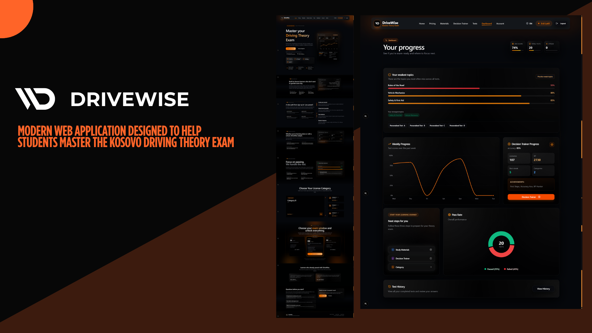

# DriveWise - Advanced Driving Theory Platform

DriveWise is a modern, full-stack web application designed to help students master driving theory through interactive tests, gamified scenarios, and intelligent analytics. Built with Next.js and Supabase, it focuses on performance, scalability, and a superior user experience.

## 🚀 Key Features

### 🧠 Intelligent Testing System
*   **Standard & Mixed Tests**: Access to official test simulations (Tests 1-10) and randomized mixed tests.
*   **Personalized Learning**: The system analyzes your performance and generates **Personalized Tests** focusing specifically on your weak topics.
*   **Real-time Feedback**: Immediate feedback on answers with explanations.
*   **Progress Saving**: Test progress is saved locally, so users never lose their place if the browser refreshes.
*   **Result Analysis**:
    *   Detailed score breakdown (Pass/Fail threshold: 80%).
    *   **Weak Topics Detection**: Identifies specific topics you struggled with in the test.
    *   **Smart Linking**: "Weak topics" automatically link directly to the relevant **Study Material** chapters for quick revision.
    *   **App Rating**: Users are prompted to rate the app experience immediately after completing their **first test**.

### 📊 Analytics Dashboard
*   **Performance Overview**: Tracks Average Score, Total Tests, and Pass/Fail ratio.
*   **Weekly Progress**: Interactive chart visualizing performance trends over the last 7 days.
*   **Advanced Insights (After 20 Tests)**:
    *   Unlocks a deep-dive "Weak Topics" analysis.
    *   Visualizes topic mastery with color-coded bars (Red/Weak, Orange/Average, Green/Strong).
    *   Calculates "Dominant Weak Category" to suggest the best area for improvement.
*   **Streak System**: Global daily streak tracker combining Test and Decision Trainer activity to boost engagement.

### 🎮 Decision Trainer
*   **Gamified Scenarios**: Real-world traffic scenarios to test hazard perception.
*   **XP & Levels**: Earn XP for correct decisions and level up.
*   **Leaderboard**: A high-performance **Materialized View** leaderboard that updates in near real-time to show top performers without taxing the database.

### 👤 User Profile & Management
*   **Subscription Management**: View active plans, remaining days, and manage Paddle subscriptions (Cancel auto-renew).
*   **Bug Reporting**: Built-in modal to report bugs directly to admins.
*   **Account Deletion**: GDPR-compliant "Danger Zone" allowing users to permanently delete their account.
    *   **Feedback Loop**: Users are asked for a reason (e.g., "Passed Exam", "Unsatisfied") before deletion, which is stored anonymously for product improvement.
*   **Security**:
    *   **Row Level Security (RLS)**: 100% of database tables are protected by RLS policies.
    *   **Role-Based Access**: Strict separation between Students, Instructors, and Admins.
    *   **Audit Logs**: Sensitive actions (role changes, bans) are automatically logged.

### 🛠️ Admin Panel
*   **User Management**:
    *   **Server-Side Pagination**: Efficiently handles thousands of users using optimized RPC functions.
    *   **Search & Filters**: Filter by Role (Admin/User) or Premium Status.
    *   **Actions**: Block users, promote to Admin, or delete accounts.
*   **Dashboard Stats**: Real-time overview of total users, tests taken, and revenue metrics.

---

## 🏗️ Tech Stack

*   **Framework**: [Next.js 14](https://nextjs.org/) (App Router, Server Components)
*   **Database**: [Supabase](https://supabase.com/) (PostgreSQL)
*   **Styling**: [Tailwind CSS](https://tailwindcss.com/)
*   **UI Components**: Shadcn/UI, Radix Primitives, Framer Motion (Animations)
*   **Charts**: Recharts
*   **State Management**: React Query (TanStack Query)
*   **Payments**: Paddle Billing
*   **Icons**: Lucide React

---

## 💾 Database Architecture

The project uses a highly optimized PostgreSQL schema with **16 tables**, custom Types, and extensive Security policies.

### Key SQL Files
The database is managed via two consolidated SQL scripts found in `/database`:
1.  **`01_schema.sql`**: Defines tables, enums, indexes, triggers, RPC functions, and storage buckets.
2.  **`02_rls.sql`**: Defines all Row Level Security policies to secure data access.

### Performance Optimizations
*   **RPC Functions**: Heavy aggregations (e.g., `get_dashboard_stats`, `get_users_with_stats`) run directly on the database engine, reducing data transfer and client-side processing.
*   **Materialized Views**: The `decision_trainer_leaderboard` is a materialized view that caches complex leaderboard calculations, refreshing only when necessary via triggers.
*   **Indexes**: Strategic GIN and B-Tree indexes on JSONB columns (`selected_options`) and foreign keys (`user_id`, `category`) ensure millisecond-query performance.

### Scalability
*   **Pagination**: The Admin User list uses a dedicated RPC (`get_users_with_stats`) to fetch paginated results with associated attempt counts in a single query, avoiding N+1 problems.
*   **Storage**: Images (questions, materials) are stored in Supabase Storage with strict size limits and RLS policies.

---

## 🛡️ Security Features

*   **RLS Policies**: Every table has explicit policies. For example:
    *   Users can only view/edit their own `user_profiles`.
    *   Only Admins can modify `admin_questions`.
    *   `bug_reports` allow generic inserts but restrict viewing to Admins.
*   **Secure Functions**: All database functions are defined with `SECURITY DEFINER` and a fixed `search_path` to prevent privilege escalation attacks.
*   **Payment Verification**: Webhooks verify Paddle signatures and cross-reference `user_id` in metadata to securely provision plans.

---

## 🌟 User Journey Highlights

1.  **Onboarding**: User signs up -> Profile automatically created via Trigger.
2.  **First Test**: User takes Test 1 -> Submits -> **Rate App Modal** appears.
3.  **Learning**: User fails a topic -> Clicks "Study" button -> Redirected to specific Material chapter.
4.  **Mastery**: User completes **20 Tests** -> Dashboard reveals "Weak Topics" module -> User takes "Personalized Test" to target those weaknesses.
5.  **Completion**: User passes exam -> Goes to Profile -> Deletes Account -> Selects "I passed!" as reason -> Account wiped, feedback saved anonymously.
